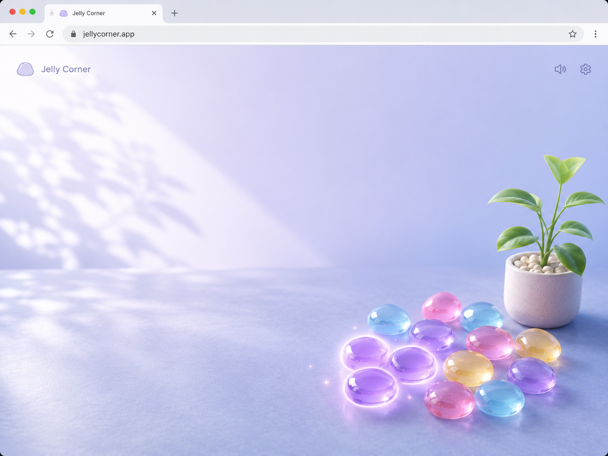

# Rain-Washed Ambient Jelly Visual Contract

## Reference Design



Use the reference for material, cool daylight, wall/table horizon, left
foliage shadow, negative space, and lower-right weight. Browser chrome and
reference labels are not product UI.

## 1. Scope / Trigger

Apply this contract when changing wallpaper, global tokens, jelly/plant assets,
pile/tray composition, quiet controls, reward motion, or responsive layout.

## 2. Signatures / Asset Slots

```text
ui/assets/ambient/wallpaper.webp
ui/assets/ambient/jelly-{aqua,amber,lime,rose}.webp
ui/assets/ambient/plant-{pot,foliage}.webp
public/favicon.{ico,png variants}
```

Runtime assets are real generated bitmaps. Do not replace them with emoji,
ASCII, CSS drawings, inline SVG approximations, placeholder boxes, or a baked
wallpaper containing interactive objects.

## 3. Contracts

- Shared tokens live in `app/styles/global.scss`: cool lavender sky/surface,
  dark blue-gray ink, quiet translucent control surfaces, a clear focus color,
  restrained lavender reward, and one shared exit easing curve.
- Wallpaper is full-bleed with a subtle wall/table horizon, left foliage
  shadow, empty left/center field, and no UI, plant, or jellies.
- At `1440x900`, the vignette anchors lower-right. There is no board, card,
  top bar, logo, level title, grid, or conventional HUD.
- Four jellies share translucent resin, upper-left highlight, internal depth,
  and a contact shadow while remaining distinct as orb, drop, leaf, and heart.
- Idle pieces use irregular spread coordinates; engaged pieces use a compact
  shallow pile. Motion changes position only and does not alter blockers.
- Blocked pieces use reduced saturation/brightness plus a quiet `覆` cue;
  selectable and focused pieces keep recognizable silhouettes.
- Plant begins as an empty ceramic pot. Generated foliage reveals upward at
  clear milestones `0,1,3,6,10,18,30,50,80`, with no numeric label.
- The seven-slot tray is the only persistent glass grouping. Quiet controls
  stay low-opacity until hover/focus and preserve practical targets.
- At `<=620px`, the vignette moves lower-center and stays gathered. No viewport
  may gain horizontal overflow.

## 4. Validation & Error Matrix

| Condition | Required outcome |
|---|---|
| Asset has opaque key-color background/fringe | reject or reprocess before import |
| Four silhouettes collapse at 32–48px | reject the set or adjust subject scale |
| Idle scene resembles rows/cells | replace authored positions; hiding borders is insufficient |
| Controls compete with scene | reduce opacity/weight, retain focus visibility |
| 320px viewport | gathered pile, readable tray, 44px targets, no overflow |
| Reduced motion | instant/near-instant projection and feedback, no lost state |
| `backdrop-filter` unsupported | translucent fallback remains readable |
| Away state | pause animation and remove transition travel |

## 5. Good / Base / Bad Cases

- Good: most pixels are quiet lavender empty space; the tactile vignette owns
  the lower-right without looking like a floating game panel.
- Base: pot plus gathered jellies and tray remain usable before any growth.
- Good: contact shadows ground objects without introducing a board surface.
- Bad: every object receives glow, continuous bobbing, or saturated particles.
- Bad: the tray expands into a dashboard or the pile becomes a rectangular
  tile matrix.

## 6. Tests Required

1. compare the supplied reference and `1440x900` prototype in one combined
   image; inspect light direction, negative space, horizon, material, and
   lower-right hierarchy;
2. capture `320x568`, `390x844`, `768x1024`, and `1440x900`;
3. inspect spread, gathered, focus, blocked, clear, first-growth, mature-growth,
   full-tray recovery, away, and reduced-motion states;
4. validate tab title `果冻`, favicon legibility, console cleanliness, and no
   horizontal overflow;
5. run UI tests and `pnpm ci:web` after visual fixes.

## 7. Wrong vs Correct

### Wrong

```scss
.game { display: grid; grid-template-columns: repeat(6, 1fr); }
.tile { background: linear-gradient(...); }
```

This recreates a board and fakes the primary bitmap material in CSS.

### Correct

```scss
.jelly-piece {
  left: calc(var(--active-x) * 100%);
  top: calc(var(--active-y) * 100%);
}

.jelly-cluster:hover .jelly-piece {
  --active-x: var(--pile-x);
  --active-y: var(--pile-y);
}
```

Generated assets provide the material; authored coordinates provide the
desktop spread and gathered pile.
