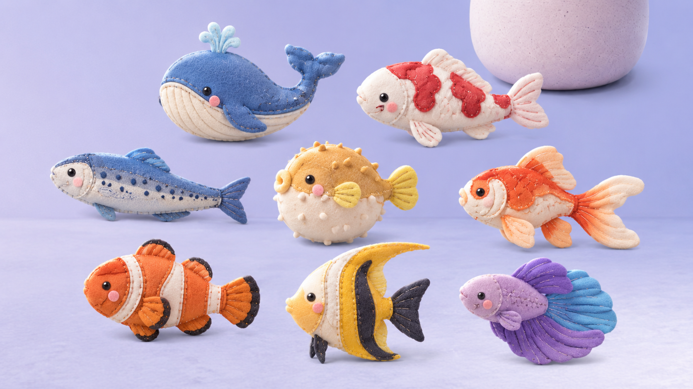

# Rain-Washed Ambient Fish Visual Contract

## Reference Design



Use the reference for material, cool daylight, wall/table horizon, left
foliage shadow, negative space, and lower-right weight. Browser chrome and
reference labels are not product UI.

## 1. Scope / Trigger

Apply this contract when changing wallpaper, global tokens, fish/plant assets,
pile/tray composition, quiet controls, reward motion, or responsive layout.

## 2. Signatures / Asset Slots

```text
ui/assets/ambient/wallpaper.webp
ui/assets/fish/fish-{whale,koi,sardine,puffer,goldfish,clownfish,angelfish,betta}.png
ui/assets/ambient/plant-{pot,foliage,flowering,fruiting,mature}.webp
ui/assets/ambient/plant-stage-{bud,lily-of-the-valley,pomegranate,peony}.webp
public/favicon.{ico,png variants}
```

Runtime assets are real generated bitmaps. Do not replace them with emoji,
ASCII, CSS drawings, inline SVG approximations, placeholder boxes, or a baked
wallpaper containing interactive objects.

## 3. Contracts

- Shared tokens live in `app/styles/global.scss`: cool lavender sky/surface,
  dark blue-gray ink, quiet translucent control surfaces, a clear focus color,
  restrained lavender reward, and one shared exit easing curve.
- Wallpaper is full-bleed with a subtle wall/table horizon, left foliage
  shadow, empty left/center field, and no UI, plant, or jellies.
- At `1440x900`, the vignette anchors lower-right. There is no board, card,
  top bar, logo, level title, grid, or conventional HUD.
- Eight fish share tactile felt, stitched seams, bead eyes, rounded volume, and
  lavender-compatible lighting while remaining distinct by species silhouette.
- Fish use one irregular full-surface arrangement of singleton and shallow
  grouped positions. Reveal, focus, and drag projection never alter canonical
  coordinates or blocker relationships.
- Fish are visually unidentifiable outside the local spotlight. Revealed
  blocked pieces use reduced saturation/brightness plus a quiet pair of
  overlapping outlines, but never gain pointer input. Focused and dragged
  pieces retain recognizable silhouettes outside the light.
- Plant begins as an empty ceramic pot. Generated foliage reveals slowly at
  clear milestones `0,100,300,600,1000,1800,3000,5000,8000`, with no numeric
  label. Stage changes use both clear count and elapsed plant age: flowering
  requires `1000 clears + 3 days`, fruiting `3000 + 10 days`, and mature ripe
  fruit `8000 + 30 days`.
- Flowering, fruiting, and mature are separate transparent bitmap assets with
  consistent framing. Do not substitute emoji or code-drawn dots for the
  blossoms and fruit.
- The current plant stage is echoed by one free-floating flower mark beside
  the pot: closed bud for growing, lily of the valley for flowering,
  pomegranate blossom for fruiting, and peony for mature. The mark grows in
  size at every stage and contains no visible word, digit, frame, or badge.
  It may transition once when the stage changes, but it does not bob at idle.
- A tray clear keeps the exact three cleared silhouettes visible for about
  620ms. They first slide from their occupied slots into one shared middle
  position, then small bubbles rise as all three dissolve together. This is
  the primary clear feedback; it becomes a static highlighted preview under
  reduced motion.
- Clearing a finite cluster fades the next, slightly harder cluster into the
  same surface. The transition communicates progression without adding a
  number, label, modal, or separate result screen.
- The seven-slot tray is the only persistent glass grouping. Quiet controls
  stay low-opacity until hover/focus, become slightly clearer on touch-only
  surfaces, and preserve 44px-or-larger targets. The empty tray is present but
  nearly transparent; occupied slots restore full readability.
- The felt cat stays visible as a desktop companion. Search travel may move it
  beside one fish without covering that fish's target; its current bounds are
  also the pointer/touch feed drop region. Only one compact, translucent speech
  bubble is shown, and it never captures input or becomes a persistent HUD.
- At `<=620px`, the same normalized field reprojects inside safe bounds and
  touch scanning replaces hover assumptions. No viewport may gain horizontal
  overflow. The cat clears the centered tray vertically, while the plant stays
  pointer-transparent above revealed fish so neither blocks fish input.
- The compact field projection compresses only rendered vertical coordinates.
  Spotlight hit testing applies its inverse and cat guard placement applies the
  same forward transform; blocker geometry and persisted anchors stay canonical.

## 4. Validation & Error Matrix

| Condition | Required outcome |
|---|---|
| Asset has opaque key-color background/fringe | reject or reprocess before import |
| Fish silhouettes collapse at 32–48px | reject the set or adjust subject scale |
| Idle scene identifies fish before search | hide fish projection without removing its semantic action path |
| Field resembles rows/cells | replace authored positions; hiding borders is insufficient |
| Controls compete with scene | reduce opacity/weight, retain focus visibility |
| 320px viewport | safe full-surface field, readable tray, 44px targets, no overflow |
| Reduced motion | instant/near-instant projection and feedback, no lost state |
| Clear reaches a plant stage before its day gate | remain in the previous stage |
| Stage mark is shown | exactly one flower, correct species and increasing size, no visible copy |
| `backdrop-filter` unsupported | translucent fallback remains readable |
| Away state | pause animation and remove transition travel |

## 5. Good / Base / Bad Cases

- Good: most pixels are quiet lavender empty space; the tactile vignette owns
  the lower-right without looking like a floating game panel.
- Base: the hidden fish field, cat, pot, and tray remain searchable and usable
  before any growth.
- Good: contact shadows ground objects without introducing a board surface.
- Bad: every object receives glow, continuous bobbing, or saturated particles.
- Bad: the tray expands into a dashboard or the pile becomes a rectangular
  tile matrix.

## 6. Tests Required

1. compare the supplied reference and `1440x900` prototype in one combined
   image; inspect light direction, negative space, horizon, material, and
   lower-right hierarchy;
2. capture `320x568`, `390x844`, `768x1024`, and `1440x900`;
3. inspect hidden idle, pointer/touch/keyboard reveal, afterglow, retained
   focus/drag, blocked, bubble clear, growing, flowering, fruiting, mature,
   full-tray recovery, away, and reduced-motion states;
4. validate tab title `小鱼`, whale favicon legibility, console cleanliness, and no
   horizontal overflow;
5. run UI tests and `pnpm ci:web` after visual fixes.

## 7. Wrong vs Correct

### Wrong

```scss
.game { display: grid; grid-template-columns: repeat(6, 1fr); }
.tile { background: linear-gradient(...); }
```

This recreates a board and fakes the primary bitmap material in CSS.

### Correct

```scss
.fish-piece {
  left: calc(var(--pile-x) * 100%);
  top: calc(var(--pile-y) * 100%);
  opacity: 0;
  pointer-events: none;
}

.fish-piece[data-revealed="true"]:not(:disabled) {
  opacity: 1;
  pointer-events: auto;
}
```

Generated assets provide the material; authored coordinates and UI-local
reveal projection provide the stable hide-and-seek field.
