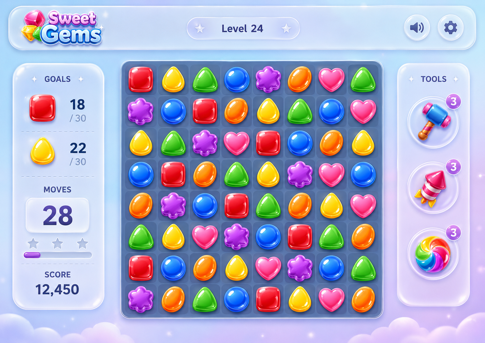

# Fresh Glass Candy Visual Design Contract

## Reference Design



Use this image to calibrate the overall composition, glass hierarchy, board
contrast, dimensional piece treatment, and light blue-lilac atmosphere. It is
directional rather than a pixel-perfect product contract: do not copy the
`Sweet Gems` logo, level number, goal values, or exact tool inventory unless
product requirements separately define them.

## 1. Scope / Trigger

Apply this contract when changing the game shell, background, HUD, board,
pieces, controls, dialogs, effects, or responsive layout.

The chosen direction is **Fresh Glass Candy**: a clean macOS/iPadOS-like
frosted-glass interface around vivid, dimensional candy or gem pieces. The
interface must feel light, refined, modern, and suitable for a broad casual
audience.

This is the target visual direction. Existing editorial paper, graphite,
serif, and hard-edged styling is legacy presentation and must not be copied
into new or refreshed game UI.

## 2. Design Tokens

Define shared visual values in `apps/web/src/app/styles/global.scss` and consume
them through custom properties. Component-local styles may derive from these
tokens, but must not introduce a competing palette.

```scss
:root {
  --background: linear-gradient(135deg, #eef5ff, #f5eeff);
  --glass: rgb(255 255 255 / 68%);
  --board: rgb(47 58 91 / 82%);
  --primary: #7167f9;
  --accent: #ffb657;
  --text: #25304a;
  --text-muted: #66708a;
  --glass-border: rgb(255 255 255 / 58%);
  --glass-blur: 20px;
  --panel-radius: 24px;
  --tile-radius: 14px;
  --panel-shadow: 0 12px 36px rgb(40 50 90 / 14%);
}
```

Required usage:

- Use a low-saturation blue-to-lilac page gradient with optional soft radial
  glows. Illustration, when added, remains blurred or low contrast.
- Use white translucent glass, a subtle light border, blur, and restrained
  shadow for peripheral UI.
- Use the darker translucent blue-gray board token so pieces remain
  immediately distinguishable.
- Use blue-violet for primary actions and amber/orange for rewards and bonuses.
- Use a clean sans-serif system stack such as
  `Inter, "SF Pro Display", "Segoe UI", sans-serif`.

## 3. Visual Contracts

### Hierarchy and color balance

- Aim for approximately 70% soft background and neutral UI, 20% vivid game
  pieces, and 10% action/reward emphasis.
- Glass belongs to the shell, HUD, goal panel, tool controls, dialogs, and
  capsules. Do not apply low-contrast frosted treatment to the pieces.
- Do not make the background, board, panels, and pieces all pale or
  translucent. The board is the highest-contrast large surface; pieces are the
  most saturated elements.
- Blur separates layers. A glass panel must still have a visible edge and
  readable foreground content.

### Background, panels, and controls

- Use the light sky-blue to lilac gradient by default. Mint-to-cream or
  blush-to-pale-orange are valid themed variants when the same hierarchy is
  preserved.
- Glass panels use `--glass`, `backdrop-filter: blur(var(--glass-blur))`,
  `--panel-radius`, `--glass-border`, and `--panel-shadow`.
- Buttons are glass capsules or circles with a minimum 44px pointer target.
  Primary actions may use a blue-violet gradient; reward actions may use a
  warm amber gradient.
- Panel entry may translate upward by 8-12px while fading in. It must settle
  without shifting surrounding layout.

### Board

- Support 7x7, 8x8, or 9x9 grids without changing the visual language. The
  engine-provided dimensions remain authoritative.
- Use a 16-24px outer radius, subtle inner shadow, and clearly visible spacing
  between cells.
- Board blur, if present, is lighter than panel blur. The dark blue-gray base
  remains visually stable during animation.
- Selection, focus, match, and invalid-swap states are distinct without relying
  on piece color alone.

### Pieces

- Pieces are high-saturation, rounded candies or gems with a top highlight,
  inner gradient, soft drop shadow, and dimensional edge treatment.
- Each type uses both a distinct hue and silhouette. Recommended mapping:
  red circle or rounded square, blue diamond or orb, green leaf, amber drop,
  violet flower/star, and pink heart/flower.
- Shape is semantic and persistent: hover, selected, matched, and disabled
  states must not erase the silhouette needed for color-vision accessibility.
- Decorative highlights and particles are `aria-hidden`; accessible board
  labels continue to identify piece type, row, column, and selection state.

### Responsive layout

- Desktop: lightweight top bar; glass goals/moves panel on the left; the
  high-contrast board in the center; compact circular or capsule power-up
  controls on the right.
- Mobile: goals and remaining moves above the board; power-ups below it. The
  square board remains the first visual priority.
- No viewport gains horizontal overflow. Preserve safe-area padding and the
  browser dimensions listed in `game-ui-contract.md`.

## 4. Motion and State Feedback

| State | Required visual response |
|---|---|
| Valid swap | 140-200ms translation with a light elastic scale |
| Invalid swap | Brief shake plus a non-color-only outline/state cue |
| Match clear | Fast shrink/fade or soft fragment burst with small particles |
| Settle/spawn | Short downward settle with restrained jelly-like overshoot |
| Combo | Gradient text near the board without covering input targets |
| Shuffle/rebuild | Clearly announced board transition after cascades |
| Panel/dialog entry | 8-12px upward fade, approximately 180-260ms |

Motion communicates state changes first and adds delight second. Particles are
display-only, do not affect board timing, and do not capture pointer events.
The chronology in `game-ui-contract.md` remains authoritative.

Under `prefers-reduced-motion: reduce`:

- Remove elastic overshoot, particle travel, and transform-heavy panel entry.
- Preserve selected, matched, invalid, combo, shuffle, and result states
  through opacity, outline, text, or near-instant transitions.
- Do not skip engine rounds, announcements, or canonical board updates.

## 5. Validation and Accessibility Matrix

| Condition | Required outcome |
|---|---|
| Text over glass | Meets WCAG AA contrast in the least favorable background area |
| Piece identification | Type remains distinguishable by hue and silhouette |
| Keyboard focus | Uses a clear high-contrast ring, not glow alone |
| Busy board | State is visible and announced; decoration does not imply interactivity |
| Strong artwork | Add a wash/blur layer until panels and board retain hierarchy |
| Blur unsupported | Opaque/semitransparent fallback keeps controls readable |
| Reduced motion | Gameplay state remains complete without elastic or particle motion |
| 320px viewport | Board, goals, and controls fit without horizontal scrolling |

## 6. Good / Base / Bad Cases and Tests

- Good: quiet blue-lilac background, one clear glass layer for the HUD, a dark
  board, vivid gem silhouettes, and restrained reward accents.
- Base: no illustration and no particles; the gradient, glass hierarchy,
  dimensional pieces, and state feedback still communicate the direction.
- Bad: all-white panels, board, and low-saturation pieces merge into a gray,
  translucent scene.
- Bad: color is the only difference between piece types.
- Bad: blur, glow, bounce, and particles run continuously instead of marking
  meaningful state changes.

Required checks for a visual refresh:

1. Verify shared tokens are used by the shell, panels, board, controls, and
   dialogs; search touched files for obsolete competing palette tokens.
2. Capture 320x568, 390x844, 768x1024, and 1440x900; assert a square board and
   no horizontal overflow.
3. Exercise selection, valid swap, invalid swap, clear, settle, combo,
   shuffle/rebuild, dialog entry, and result states.
4. Repeat the state pass with reduced motion enabled.
5. Check keyboard focus, hue-plus-silhouette identification, text contrast,
   and the no-`backdrop-filter` fallback.
6. Run the UI tests and `pnpm ci:web` after visual and browser checks.

## 7. Raster Piece Asset Contract

Apply this contract when adding or replacing candy-piece raster artwork.

### Output contract

- Store final assets under
  `apps/web/src/features/game/ui/assets/candy-{type}.png`.
- Use a 512×512 RGBA PNG canvas with an alpha range that includes both 0 and
  255; all four corner pixels must be fully transparent.
- Normalize the longest visible-subject edge to 416–424px and leave at least
  32px transparent margin on every side.
- Keep every type visually distinct by both hue and persistent silhouette.
  Files must be independently generated or authored, not recolored duplicates.
- Fix and record the selected source set before UI integration. Do not keep
  regenerating accepted assets during component or visual-QA work.

### Inspection and validation

1. Read file size, dimensions, color mode, and alpha before inspecting pixels.
2. When visual identification is required, create a preview no larger than
   512px, inspect one image at a time, and persist the result before continuing.
3. Process and validate one final output at a time. Check PNG decoding, RGBA
   mode, alpha extrema, transparent corners, visible bounds, margin, and file
   uniqueness.
4. Delete temporary previews after the final automated pass. Keep selected
   sources, final assets, source-to-output mappings, and validation results.

| Condition | Required result |
|---|---|
| Missing type | Generate or source it only after an explicit product decision |
| Non-RGBA or opaque corners | Reject the output |
| Visible subject within 32px of an edge | Re-normalize before integration |
| Longest subject edge outside 416–424px | Re-normalize before integration |
| Key-color fringe or clipping | Reject or reprocess after single-image review |
| Duplicate file content | Reject even if filenames differ |

- Good: six independently recognizable pieces pass the numeric contract and
  single-image edge review before UI integration.
- Base: simple local PNGs with no particles or shadows still pass the same
  alpha, size, margin, and silhouette checks.
- Bad: repeatedly reopen full-resolution sources, generate variants during UI
  work, or inspect every image before writing any result.

## 8. Wrong vs Correct

### Wrong

```scss
.page,
.panel,
.board,
.tile {
  color: #c9ceda;
  background: rgb(255 255 255 / 45%);
  backdrop-filter: blur(20px);
}
```

This removes the contrast hierarchy, weakens rapid piece recognition, and
makes repeated glass layers look muddy.

### Correct

```scss
.page {
  color: var(--text);
  background: var(--background);
}

.hud-panel {
  border: 1px solid var(--glass-border);
  border-radius: var(--panel-radius);
  background: var(--glass);
  box-shadow: var(--panel-shadow);
  backdrop-filter: blur(var(--glass-blur));
}

.game-board {
  border-radius: 20px;
  background: var(--board);
  box-shadow: inset 0 1px 1px rgb(255 255 255 / 12%);
}

.game-tile {
  filter: drop-shadow(0 6px 8px rgb(21 28 52 / 28%));
}
```

This keeps the interface clean and glass-like while preserving the board and
pieces as the game's fastest-readable layer.
