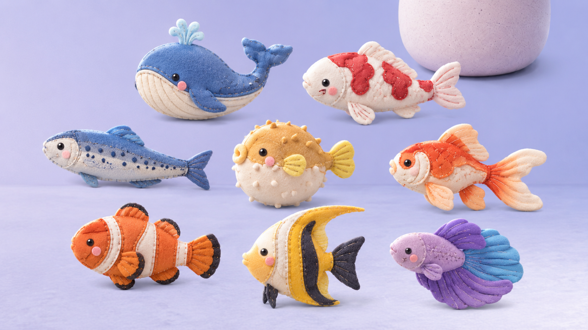

# Rain-Washed Ambient Fish Visual Contract

## Reference Design



Use the reference for material, cool daylight, wall/table horizon, left
foliage shadow, negative space, and lower-right weight. Browser chrome and
reference labels are not product UI.

## 1. Scope / Trigger

Apply this contract when changing wallpaper, global tokens, fish/cat/plant
assets, pile/tray composition, small-to-large delivery, bond-stage props,
quiet controls, reward motion, or responsive layout.

## 2. Signatures / Asset Slots

```text
ui/assets/ambient/wallpaper.webp
ui/assets/fish/fish-{whale,koi,sardine,puffer,goldfish,clownfish,angelfish,betta}.webp
ui/assets/cat/cat-{idle,eating,full,lying,sleeping}.webp
ui/assets/cat/cat-{yarn-ball,cushion}.webp
ui/assets/ambient/plant-{pot,foliage,flowering,fruiting,mature}.webp
ui/assets/ambient/plant-stage-{bud,lily-of-the-valley,pomegranate,peony}.webp
public/favicon.{ico,png variants}
```

Runtime assets are real generated bitmaps. Do not replace them with emoji,
ASCII, CSS drawings, inline SVG approximations, placeholder boxes, or a baked
wallpaper containing interactive objects.

## 3. Contracts

- Shared tokens live in `app/styles/global.scss`: cool lavender sky/surface,
  dark blue-gray ink, quiet translucent control surfaces, a clear focus color,
  restrained lavender reward, and one shared exit easing curve.
- Wallpaper is full-bleed with a subtle wall/table horizon, left foliage
  shadow, empty left/center field, and no UI, plant, or jellies.
- At `1440x900`, the vignette anchors lower-right. There is no board, card,
  top bar, logo, level title, grid, or conventional HUD.
- Eight fish share tactile felt, stitched seams, bead eyes, rounded volume, and
  lavender-compatible lighting while remaining distinct by species silhouette.
- Field and tray fish are visually small while retaining a 44px hit target.
  Three same-species tray fish form one transient large fish that is clearly
  bigger at a glance; size contrast communicates combination without cutting,
  fragments, seams, or body-part imagery.
- Fish use a seed-reproducible, irregular full-surface arrangement of singleton
  and shallow grouped positions. Safe regions reserve the cat, plant, and tray;
  bounded footprint-aware rejection prevents extreme piles while preserving
  controlled overlap and four-quadrant coverage. Reveal, focus, and drag
  projection never alter canonical coordinates or blocker relationships.
- Fish may rotate through the complete `[0, 360)` range. The stable button
  target and rotation-independent conservative overlap footprint keep vertical
  and inverted silhouettes aligned with interaction and settling behavior.
- Fish are visually unidentifiable outside the local spotlight except for a
  very faint silhouette in its outer directional hint ring. Hinted silhouettes
  remain pointer-transparent and do not count as revealed. Revealed pieces
  remain fully actionable at every layer. A revealed stack quietly fans apart
  to expose distinct pointer targets; removing one may make directly related
  neighbors slide a few pixels sideways and down before settling. Neither
  motion changes canonical positions. Focused and dragged pieces retain
  recognizable silhouettes outside the light.
- Interaction motion uses one quiet exponential ease-out language: direct
  selection and tray landing take `150-250ms`; intro, three-fish gathering,
  large-fish formation, delivery, and plant response take `480-700ms`; level arrival may
  remain visible for about `960ms`. Do not add spring motion, casino particles,
  or full-screen flashes. Reduced motion keeps static light, outline, shadow,
  color, copy, and pressure states while removing travel and pulse animation;
  content is usable before animation ends.
- The first untouched scene demonstrates the loop without an input lock: the
  spotlight scans to the initial discoverable match, its three targets lift
  with layer-aware timing, and the first empty tray slot responds. A short
  visible instruction may remain until the first successful selection even
  after real input takes over the spotlight; it must not become a start gate,
  tutorial panel, or persistent HUD.
- Plant begins as an empty ceramic pot. Generated foliage reveals continuously
  from the first clear: clear `1` reaches 4%, the first field's 12 clears reach
  18%, and later nodes `100,300,600,1000,1800,3000,5000,8000` preserve the
  long-term arc, with no numeric label. Stage changes use both clear count and
  elapsed plant age: flowering
  requires `1000 clears + 3 days`, fruiting `3000 + 10 days`, and mature ripe
  fruit `8000 + 30 days`.
- Flowering, fruiting, and mature are separate transparent bitmap assets with
  consistent framing. Do not substitute emoji or code-drawn dots for the
  blossoms and fruit.
- The current plant stage is echoed by one free-floating flower mark beside
  the pot: closed bud for growing, lily of the valley for flowering,
  pomegranate blossom for fruiting, and peony for mature. The mark grows in
  size at every stage and contains no visible word, digit, frame, or badge.
  It may transition once when the stage changes, but it does not bob at idle.
  A normal clear may additionally show one transient `植物 +1 成长` cue near
  the plant; this cue disappears with clear feedback and never becomes part of
  the persistent stage mark.
- A combination keeps the exact three tray silhouettes visible for about
  700ms. They gather at one shared tray center, give way to one same-species
  large fish, and that fish travels to the cat as its eating pose begins. This
  is the primary completion feedback; reduced motion shows the large fish
  statically beside the cat while preserving the same state and copy.
- Clearing a finite cluster fades the next, slightly harder cluster into the
  same surface. A short non-modal cue may state the current species count and
  deeper stacking, but it must not add a numeric level label, confirmation,
  persistent progression HUD, or separate result screen.
- The seven-slot tray is the only persistent glass grouping. Quiet controls
  remain visually secondary yet readable at rest, become clearer on
  hover/focus and touch-only surfaces, and preserve 44px-or-larger targets. The
  empty tray is present but nearly transparent; occupied slots restore full
  readability.
- At five entries the tray gains a static warm caution edge. At six entries it
  adds a slower, stronger pressure cue; reduced motion replaces the pulse with
  a fixed outline. A same-species combination uses the lavender reward and
  plant response.
- The felt cat stays visible beside the plant pot in its home state. Cat and
  plant use shared responsive position/width variables so desktop, mobile, and
  compact compositions keep them adjacent without covering the tray. Search
  travel may move the cat beside one fish without covering that fish's target;
  its current bounds may detect a direct single-fish drop only to show the
  combine-first hint and restore that fish. On arrival from search, a
  steady warm local beam reveals the guarded fish independently from the
  movable pointer spotlight. The outer artwork canvas remains pointer-
  transparent and a pose-aligned 44px-or-larger trigger owns activation, so
  transparent pixels cannot block fish beneath them; keyboard focus follows
  the visible silhouette instead of the artwork rectangle.
- Cat motion has one independent channel: gentle idle breathing, synchronized
  eating, petting nuzzle with restrained purr rings, searching hop, guarding,
  resting, sleeping, and loss. Pose assets cross-fade in place so there is no
  transparent frame between them. Reduced motion preserves pose and static
  state cues without displacement.
- Bond props accumulate without becoming a HUD: feeds `0..2` show the newcomer
  scene, feeds `3..8` add one dusty-lavender felt yarn ball, and feeds `9+` add
  one muted-blue oval felt cushion beneath the cat. Both generated props match
  the existing tactile cat material, remain pointer-transparent, and fit every
  responsive vignette.
- Home interaction uses one compact translucent two-action menu anchored to the
  cat's right side. The actions stack vertically inside one pale lavender
  cat-ear speech bubble with a quiet stitched divider and small lower-left
  tail; they do not read as two separate pill buttons. Each action remains at
  least 44px from the first rendered frame; menu entrance may fade or translate
  but must not scale the targets below that minimum. It fits inside `320x240`
  without covering the top-right quiet controls or tray and remains distinct
  from the one pointer-transparent reaction bubble. Neither becomes a
  persistent HUD.
- At `<=620px`, the same normalized field reprojects inside safe bounds and
  touch scanning replaces hover assumptions. No viewport may gain horizontal
  overflow. The cat clears the centered tray vertically, while the plant stays
  pointer-transparent above revealed fish so neither blocks fish input.
- At `<=620px × <=430px`, use the compact-surface variables rather than a
  minimum-height canvas: retain 44px-or-larger controls with 14px labels,
  reduce the cat and plant footprints, keep the tray fully visible, and fit the
  complete surface without horizontal or vertical overflow. Apply the same
  composition to a normal narrow window and Document PiP.
- The compact field projection compresses only rendered vertical coordinates.
  Spotlight hit testing applies its inverse and cat guard placement applies the
  same forward transform; overlap geometry and persisted anchors stay canonical.

## 4. Validation & Error Matrix

| Condition | Required outcome |
|---|---|
| Asset has opaque key-color background/fringe | reject or reprocess before import |
| Fish silhouettes collapse at 32–48px | reject the set or adjust subject scale |
| Three small fish combine | show one clearly larger same-species fish and an unbroken causal path from tray to cat |
| Direct single-fish drop reaches the cat | restore the small fish and show the combine-first hint; do not depict biting or cutting |
| Idle scene identifies fish before search | hide fish projection without removing its semantic action path |
| Field resembles rows/cells | replace authored positions; hiding borders is insufficient |
| Controls compete with scene | reduce weight while retaining readable resting contrast and focus visibility |
| 320px viewport | safe full-surface field, readable tray, 44px targets, no overflow |
| `320x240` compact surface | full surface, controls, cat, plant cue, and tray remain visible with no scroll overflow |
| Cat interaction menu opens | keep both actions inside the viewport at 44px or larger, with the home cat still legible beside the pot |
| Cat menu opens from pointer input | keep the unified bubble surface free of a persistent nested-button focus ring; keyboard activation still exposes a visible focus indicator |
| Reduced motion | instant/near-instant projection, static large fish beside the cat, visible pose change, and no lost state |
| Bond stage becomes familiar or bonded | reveal exactly the yarn ball or yarn-plus-cushion scene without covering cat, plant, tray, or fish targets |
| Clear reaches a plant stage before its day gate | remain in the previous stage |
| Stage mark is shown | exactly one flower, correct species and increasing size, no persistent visible copy; a clear-only growth cue may coexist transiently |
| `backdrop-filter` unsupported | translucent fallback remains readable |
| Away state | pause animation and remove transition travel |

## 5. Good / Base / Bad Cases

- Good: most pixels are quiet lavender empty space; the tactile vignette owns
  the lower-right without looking like a floating game panel.
- Base: the hidden fish field, cat, pot, and tray remain searchable and usable
  before any growth.
- Good: contact shadows ground objects without introducing a board surface.
- Good: the home cat and pot read as one lower-right vignette, and the transient
  action menu remains subordinate to them.
- Good: the small-to-large size jump reads before the delivery motion, and cat
  chewing begins in the same completion beat.
- Bad: every object receives glow, continuous bobbing, or saturated particles.
- Bad: menu animation scales a 44px action below its minimum hit target.
- Bad: fish are sliced, stitched from visible parts, or disappear without a
  readable large-fish handoff.
- Bad: the tray expands into a dashboard or the pile becomes a rectangular
  tile matrix.

## 6. Tests Required

1. compare the supplied reference and `1440x900` prototype in one combined
   image; inspect light direction, negative space, horizon, material, and
   lower-right hierarchy;
2. capture `320x240`, `320x568`, `390x844`, `768x1024`, and `1440x900`;
3. inspect hidden idle, pointer/touch/keyboard reveal, afterglow, retained
   focus/drag, pointer-transparent outer hint silhouettes, stacked lower
   selection and settling, cat menu open, transparent cat-artwork hit testing,
   guarded-fish marker, pet reaction, three-small-fish gathering, large-fish
   formation/delivery, synchronized eating, newcomer/familiar/bonded props,
   pose cross-fade, bubble clear, growth cue, growing, flowering, fruiting, mature,
   full-tray loss, away, and reduced-motion states;
4. validate the home cat/pot relationship and 44px menu actions at every
   captured viewport, plus tab title `小鱼`, whale favicon legibility, console
   cleanliness, and no horizontal overflow;
5. run UI tests and `pnpm ci:web` after visual fixes.

## 7. Wrong vs Correct

### Wrong

```scss
.game { display: grid; grid-template-columns: repeat(6, 1fr); }
.tile { background: linear-gradient(...); }
```

This recreates a board and fakes the primary bitmap material in CSS.

### Correct

```scss
.fish-piece {
  left: calc(var(--pile-x) * 100%);
  top: calc(var(--pile-y) * 100%);
  opacity: 0;
  pointer-events: none;
}

.fish-piece[data-revealed="true"]:not(:disabled) {
  opacity: 1;
  pointer-events: auto;
}

.cat-companion__menu-action {
  min-height: 44px;
}

@media (prefers-reduced-motion: reduce) {
  .cat-menu-enter-active,
  .cat-menu-leave-active,
  .cat-companion__menu-action {
    transition: none;
  }
}
```

Generated assets provide the material; engine-owned constrained coordinates
and UI-local reveal projection provide the stable hide-and-seek field.
