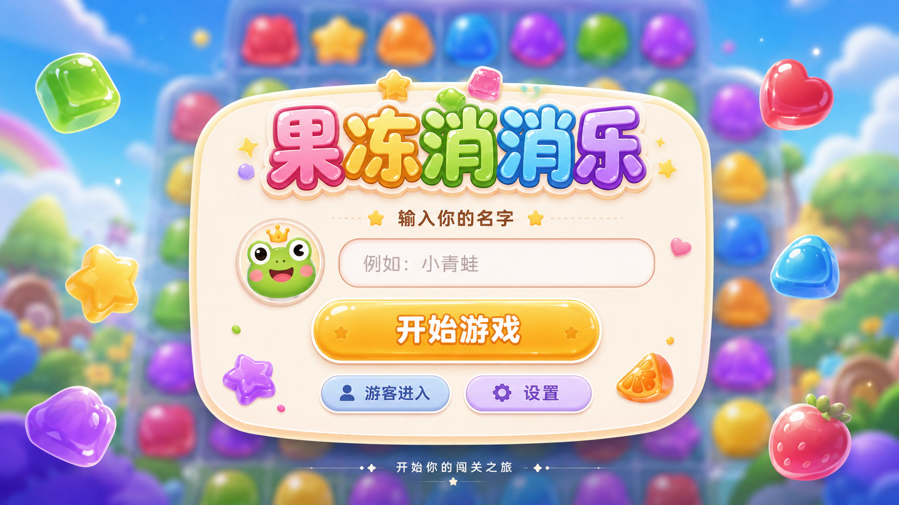
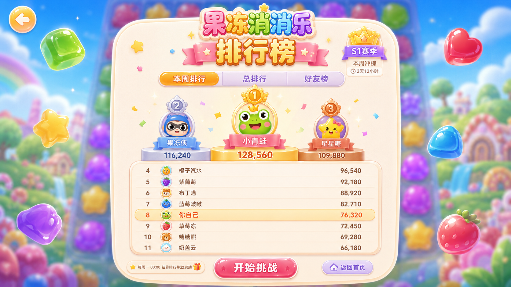

# 局内进度与本机排行榜设计

## Player-start visual reference



用户提供的 1672×941 设计稿是姓名输入/开始游戏状态的构图参考。实现提取以下
层级：模糊棋盘环境 → 居中高对比输入面板 → 单一醒目开始按钮 → 少量糖果装饰。
视觉语言需翻译为项目已经确定的 Fresh Glass token 和六类本地糖果素材，不直接
复制图中的品牌 Logo、青蛙头像、游客入口、设置按钮、关卡文案或整张背景。

详细观察、元数据与边界记录在
`research/player-start-screen-reference.md`。

## Leaderboard visual reference



用户提供的 1672×941 设计稿是排行榜的信息层级与构图参考。实现提取：
前三名形成独立视觉梯队、后续名次使用紧凑行、当前玩家高亮、分数右对齐，
并把参考中的三个切换项改为产品所需的“本周 / 本月 / 总排行”。

所有排名使用同一张项目本地默认糖果头像，不生成或分配个性头像。实现不复制
参考中的品牌 Logo、好友榜、赛季徽章、赛季倒计时、返回首页或开始挑战按钮，
也不把整张参考图作为页面背景。详细观察、元数据与边界记录在
`research/leaderboard-reference.md`。

## Architecture

```text
engine SwapResult / CascadeRound
  -> session/scoring.ts (pure score projection)
  -> game-controller.ts (move/session state machine)
  -> GameHud / GameResultDialog

player name + completed result
  -> session/progress-storage.ts (validate, rank, version, persist)
  -> controller leaderboard ref
  -> GameLeaderboard

PlayerStartDialog
  -> normalized local display name
  -> controller.startGame(name)
```

引擎继续只负责棋盘规则。计分和扣步属于 session 层，Vue 控制器只编排
引擎结果、动画时序和 session 纯函数。组件不解析匹配组，也不直接读写
`localStorage`。

## Session state

```ts
type SessionPhase =
  | "awaiting-player"
  | "playing"
  | "resolving"
  | "won"
  | "lost";
```

- 初始为 `awaiting-player`，姓名校验通过后生成独立新局并进入 `playing`。
- 相邻交换交给引擎；只有 `resolved` 扣除一次步数并进入 `resolving`。
- `invalid` 与 `no-match` 回到 `playing`，不改变步数和分数。
- 每个 cascade round 完成时累加该轮分数并更新当前/最高连击。
- 全部动画与洗牌完成后，先判目标分胜利，再判步数耗尽失败。
- 终局写入存储和排行榜一次；结果层出现后棋盘不再接收输入。

## Player-name contract

- 输入使用 `trim()`，内部连续空白折叠为单个空格。
- 以 Unicode code point 计数，允许 1–12 个字符。
- Vue 文本渲染负责转义；姓名不拼接为 HTML、CSS 或存储键。
- 姓名只随完成记录存入浏览器，不上传、不生成设备或远程标识。

## Scoring contract

集中配置：

```ts
interface SessionConfig {
  initialMoves: number;
  targetScore: number;
  pointsPerTile: number;
  longMatchBonusPerTile: number;
  multiGroupBonus: number;
  leaderboardLimit: number;
  historyLimit: number;
}
```

每轮先对 `matches.coordinates` 中的唯一棋子计基础分，再按每个 group 超过
3 枚的部分增加长连奖励，多组匹配从第 2 组起增加组合奖励。整轮小计乘以
`CascadeRound.index`，因此交叉公共棋子不会重复获得基础分，而后续自动连锁
具有更高倍率。所有加法饱和到 `Number.MAX_SAFE_INTEGER`。

目标分使用固定种子自动游玩样本校准。100 个种子各执行 18 次由引擎返回的
随机合法移动，得到：最低 6,775、P10 8,700、P25 10,550、P40 11,725、
中位数 12,500、P60 14,675、P75 17,150、P90 22,025、最高 34,800。
原 8,000 分目标达标 98%，过于宽松；最终目标改为 **12,000 分**，样本达标
58%，并由定向测试约束在 50%–70% 区间。模拟不代表真人策略上限，但可防止
后续规则调整让默认挑战明显失衡。

## Storage schema

```ts
interface LocalProgressV1 {
  version: 1;
  bestScore: number;
  bestCombo: number;
  lastCompletedAt: string | null;
  leaderboard: readonly LeaderboardEntry[];
  history: readonly LeaderboardEntry[];
}

interface LeaderboardEntry {
  playerName: string;
  score: number;
  bestCombo: number;
  completedAt: string;
  outcome: "won" | "lost";
}
```

存储键固定为 `web-match3:progress`。`leaderboard` 保存按玩家去重后的总榜
Top 10；`history` 保存有上限的近期完成记录，用于派生本周和本月榜。读取从
`unknown` 做完整运行时校验：版本、有限非负安全整数、ISO 时间、姓名长度、
结果枚举和数组长度均不符合时整体回退为空记录。缺少 `history` 的有效早期
v1 快照用已有总榜初始化历史。浏览器禁止访问或配额写入失败时吞掉存储异常，
继续当前局。

排行先按周期过滤，再按姓名选择最佳成绩，最后按分数降序、最高连击降序、
完成时间升序稳定排序并截取前 10。本周使用当地时间周一 00:00，本月使用
当地时间当月 1 日 00:00，总排行直接使用持久化 Top 10。终局函数同时返回
新最佳标记、当前记录的总榜名次和下一份持久化快照，避免 UI 重复实现排序。

## UI integration

- `PlayerStartDialog` 首次自动聚焦姓名输入，显示内联校验错误并限制 Tab。
- Top bar 显示当前玩家；等待姓名时棋盘由模态层阻止交互。
- `GameLeaderboard` 在右侧工具区显示本周、本月、总排行切换，前三名使用
  紧凑领奖台层级，其余名次列表化；所有条目使用同一本地默认头像，并高亮
  当前玩家。移动端位于棋盘之后。
- `GameResultDialog` 展示玩家、分数、最高连击和总榜名次，并提供“再来一局”
  与“换玩家”两个真实操作。
- 现有重开确认、键盘棋盘、动画 generation token 和 reduced-motion 时序保持。

## Compatibility and rollback

- 不新增依赖、路由、后端或远程请求。
- 旧浏览器中不存在、损坏或不可访问的本地存储均视为空记录。
- 不实现好友、赛季、排行倒计时或远程身份；三个周期榜均只来自当前浏览器。
- 回滚可移除 session 目录和两个新组件，并恢复控制器/UI props；引擎无需回滚。
